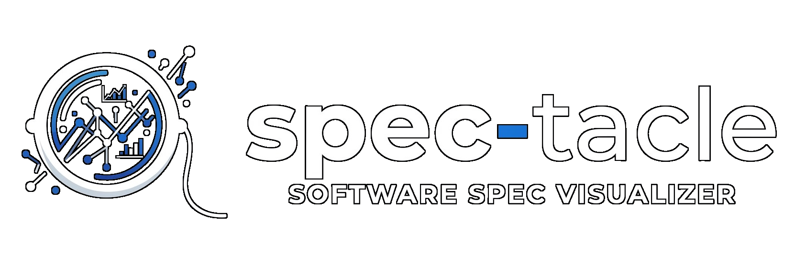

spec-tacle turns any technical document into a page that is actually readable and understandable - and visually editable. Summary at the top in short bullets. Diagrams laid out for reading. Every node and arrow has a description that appears on hover. Every text field is editable in place. Hit **Update spec** and the changes flow back into the spec file with a timestamped backup, so the visualizer and the source stay the same document.

## See it live

**[michaelficocelli.github.io/spec-tacle](https://michaelficocelli.github.io/spec-tacle/)** — a static example visualizing a spec for "Snip" (a URL-shortener) . Everything is editable in the browser so you can feel the shape of the tool: drag nodes, bend arrows, rewrite captions. Note there is no backend on that demo for undo or saving — that's what `npx spec-tacle demo` (below) adds.

## Full local demo

```sh
npx spec-tacle demo
```

That stages the bundled Tasky example (a fictional shared to-do app spec) in a temp directory, renders it, and starts a local server. Open the URL it prints. Drag nodes around, rewrite a caption, add a note under a diagram, watch the source file change.

## Use it as a skill for Claude or Codex

Install the skill for Claude Code:

```sh
mkdir -p ~/.claude/skills/spec-tacle
npx spec-tacle skill > ~/.claude/skills/spec-tacle/SKILL.md
```

For Codex or any other editor with named skills, drop the same file wherever it picks skills up.

Then in a session:

> spec-tacle this: docs/product-brief.md

The skill does the whole workflow itself — drafts the summary bullets, picks the diagrams, writes the mermaid, produces a data JSON next to your spec, inserts marker anchors into the spec, renders the visualizer, starts the local server, and opens the visualizer in your default browser. You don't need to type `npx spec-tacle render` or `npx spec-tacle serve` — the skill runs those for you.

Invoke it naked ("spec-tacle this") and it'll ask what to include. Point it at a markdown file, a stack of files, a transcript, one or more images of a whiteboard, or a mix — it merges them into one spec first, then produces the visualizer.

Edit anything you want in the browser, hit Update spec. Your spec file now reflects your edits.

## Round-trip, in one paragraph

Every editable region in the visualizer is mapped to an HTML-comment marker anchor added to the spec (`<!-- spec-tacle:summary:what -->`, `<!-- spec-tacle:diagram:architecture:caption -->`, and so on). The Update button POSTs your edits to the local server, which writes a timestamped backup of the spec into a `backups/` folder next to it and rewrites only the content between the markers. Anything outside the markers is left alone. Undo restores the most recent backup and pops it off the stack. Your spec stays yours; the visualizer just gives you a nice surface to edit it.

## Writing quality

The skill embeds a strict subset of the [no-ai-slop](https://github.com/petergyang/no-ai-slop) rules so the drafted prose reads like a human wrote it. No em-dashes. No fluffy short sentences. Concrete over abstract; every claim carries its own weight or gets cut.

## Development

```sh
git clone https://github.com/michaelficocelli/spec-tacle
cd spec-tacle
npm test
node bin/spec-tacle.js demo
```

Node 18+. Tests use `node:test`.

## License

MIT
