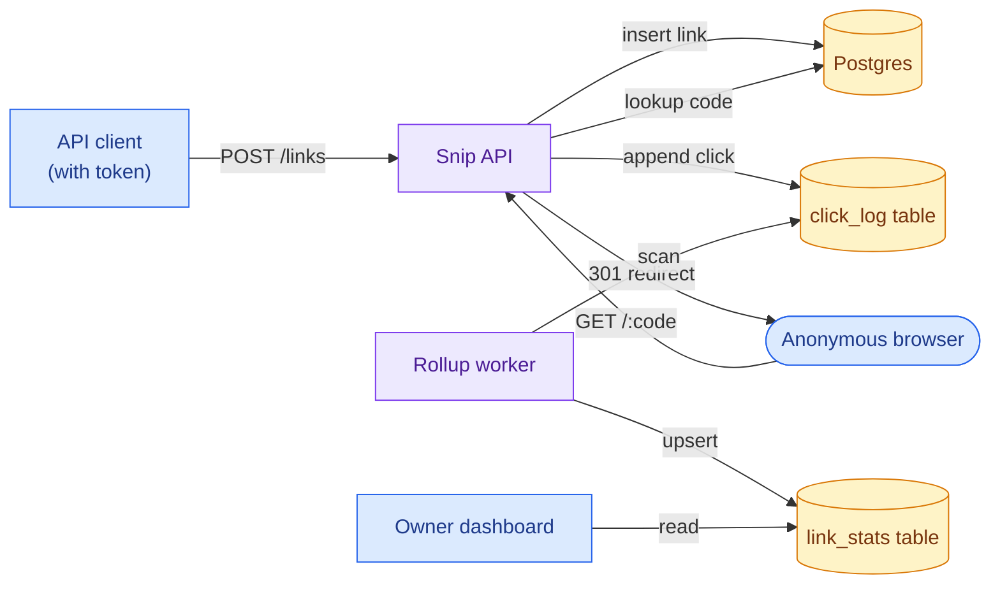
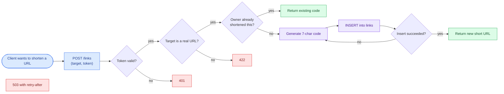
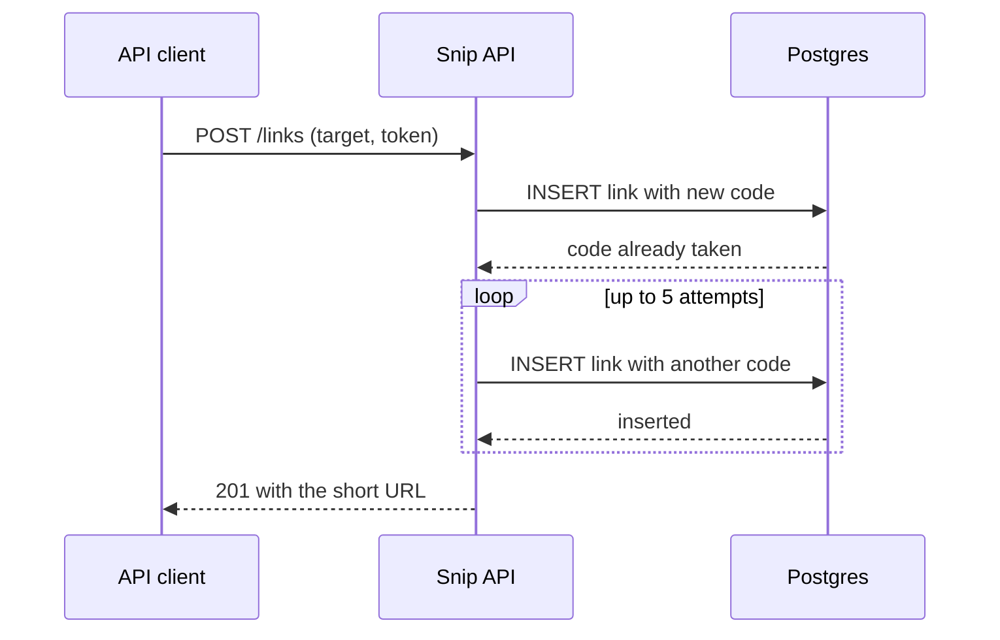
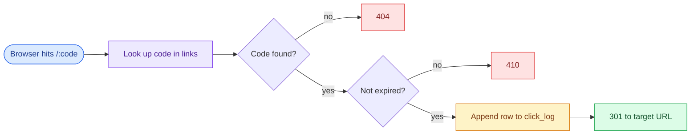
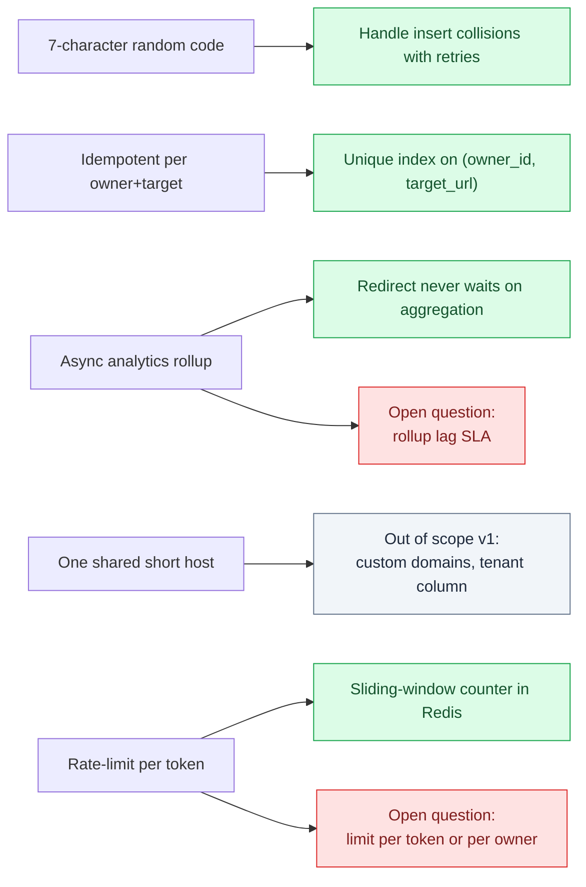
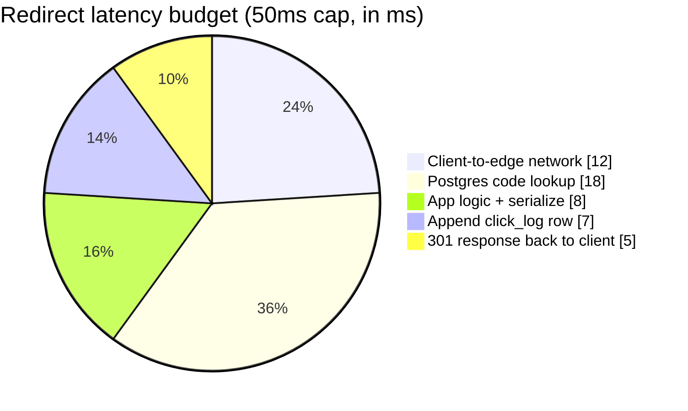

# Snip — Product Spec

## Summary

**What we're building**

<!-- spec-tacle:summary:what -->
- Snip is a URL shortener: it turns a long web address into a short link and sends anyone who clicks that link on to the original address
- One web service does both jobs: an API (the interface other programs call) creates links, and a redirect endpoint answers clicks on them
- **Postgres**, the database, stores each short code with its target address, owner, and expiration date, plus a log of every click
- A rollup worker, a background job, adds the click log up into hourly and daily totals so the owner's dashboard reads one row per link per day
- Two kinds of user: creators, who identify themselves with an API token (a secret key sent with each request), and anonymous viewers, who only follow links
<!-- /spec-tacle:summary:what -->

**Why it earns the effort**

<!-- spec-tacle:summary:why -->
- Existing shorteners are either bloated dashboards or bare hosted forms that keep no record of who created a link
- A **narrow shape** (one code, one target, one click log) keeps the storage and the analytics boring
- Click counting runs apart from the redirect so a busy link never slows the redirect down
<!-- /spec-tacle:summary:why -->

**Rules it must uphold**

<!-- spec-tacle:summary:rules -->
- A redirect must answer within **50ms**
- The redirect never waits on click counting or the rollup
- The same owner shortening the same target always gets the same code back
- Every link is served from one shared short host in v1; custom domains are not supported
- Each API token is rate-limited
<!-- /spec-tacle:summary:rules -->

## Problem

People who need a short link today choose between two bad options. Full marketing suites bury link creation under campaign dashboards, and bare hosted forms hand back a link with no record of who made it or how often it was clicked. Snip does one thing: one short code points at one target address, and every click is counted.

## Users

- **Creator**: makes short links through the API and reads click totals on a dashboard. Identified by an API token, a secret key sent with each request.
- **Viewer**: anyone who clicks a short link. No account, no token. They are redirected and never see Snip itself.

## Solution Overview

One web service with two surfaces:

1. A **create-link API**. A creator sends a target address and gets a short URL back.
2. A **redirect endpoint** on the short host. A click on `https://snip.example/abc1234` is answered with a redirect to the target address.

Behind it: a Postgres database that stores the links and a log of every click, and a rollup worker that turns the click log into hourly and daily totals for the creator's dashboard.

## Core Flows

### Create a short link

1. The client sends `POST /links` with the target URL and its API token.
2. The API rejects a bad token with 401 and a target that isn't an absolute URL with 422.
3. If this owner has already shortened the same target, the API returns the existing code.
4. Otherwise the API generates a 7-character random code and inserts the link.
5. If the code is already taken the insert fails, and the API generates another code and tries again, up to 5 times. After 5 collisions it returns 503 with a retry-after header.
6. The API returns the new short URL.

### Follow a short link

1. The browser requests `GET /:code` on the short host.
2. The API looks the code up in the `links` table.
3. An unknown code returns 404. An expired link returns 410.
4. For a live link the API appends a row to `click_log` (code, timestamp, coarse location from the IP address) and returns a 301 redirect to the target URL.

## Architecture

### Components

- **Snip API**: the one web service. Handles `POST /links` and `GET /:code`.
- **Postgres `links` table**: short code, target URL, owner, expiration date.
- **Postgres `click_log` table**: one row per click.
- **Rollup worker**: a background job that reads `click_log` and writes totals.
- **Postgres `link_stats` table**: hourly and daily click totals, one row per link per day.
- **Owner dashboard**: reads `link_stats` only.

### Analytics rollup

The rollup worker scans `click_log` on a schedule and upserts hourly and daily totals into `link_stats`. The dashboard reads those totals and never touches `click_log`, so analytics load stays off the redirect path. The redirect never waits on the rollup.

## Key Decisions

- **7-character random code.** Short enough to type, long enough that collisions are rare. Rare is not never, so inserts retry on collision.
- **Idempotent per owner and target.** The same owner shortening the same target gets the same code back, enforced by a unique index on `(owner_id, target_url)`.
- **Asynchronous analytics rollup.** Clicks are logged at redirect time and totalled later, so the redirect never waits on aggregation.
- **One shared short host.** Every link lives on the same host, so the schema needs no tenant column.
- **Rate limit on link creation.** A sliding-window counter in Redis, an in-memory store, caps how many links an API token can create.

## Performance Budget

A redirect must answer within 50ms. These are design targets, not measurements:

| Step | Budget (ms) |
|---|---|
| Client-to-edge network | 12 |
| Postgres code lookup | 18 |
| App logic and serialization | 8 |
| Append `click_log` row | 7 |
| 301 response back to the client | 5 |

## Out of Scope (v1)

- Custom domains. They would need a tenant column and a DNS lookup that the 50ms budget has no room for.
- Editing a link's target after creation.
- Link previews and QR codes.

## Open Questions

<!-- spec-tacle:summary:open-questions -->
- How far behind real time may the rollup run? No lag limit is set yet.
- Is the rate limit counted per API token or per owner?
<!-- /spec-tacle:summary:open-questions -->

## Diagrams

Each diagram has a short caption and a longer "About" block. Edit them in the visualizer and use **Update spec** to write changes back here.

### Service shape and data flow

<!-- spec-tacle:diagram:architecture:caption -->
Two entry paths (**create** and **redirect**) share Postgres; a background worker builds the analytics rollup from the click log so the redirect never blocks on aggregation. Blue nodes are callers, purple our services, and amber the tables.
<!-- /spec-tacle:diagram:architecture:caption -->

<!-- spec-tacle:diagram:architecture:detail -->
- **Create path**: authenticated client → API `POST /links` → Postgres `links`
- **Redirect path**: anonymous browser → short host `GET /:code` → Postgres `links` lookup → 301 → append a row to `click_log`
- **Analytics**: rollup worker reads `click_log` on a schedule, upserts hourly/daily aggregates into `link_stats`
- **How to read**: the create/redirect paths sit on top of Postgres; the worker branches off `click_log` and writes back to a separate table so the analytics load never touches the redirect path
<!-- /spec-tacle:diagram:architecture:detail -->

<!-- spec-tacle:diagram:architecture:notes -->

<!-- /spec-tacle:diagram:architecture:notes -->

<!-- spec-tacle:diagram:architecture -->
**Nodes**

- `Client`: API client / (with token) — A program that creates links on a creator's behalf and sends the creator's API token with each request.
- `Browser`: Anonymous browser — Anyone who clicks a short link. No account and no token.
- `API`: Snip API — The one web service. It creates links and answers every click on a short link.
- `PG`: Postgres — The links table: short code, target address, owner, and expiration date.
- `Log`: click_log table — One row per click, written at redirect time and read only by the rollup worker.
- `Worker`: Rollup worker — Background job that runs on a schedule and adds click rows up into hourly and daily totals.
- `Stats`: link_stats table — The totals the dashboard reads: one row per link per day.
- `Dash`: Owner dashboard — Where a creator sees how often each of their links was clicked.

**Edges**

- `Client` → `API`: "POST /links".
- `API` → `PG`: "insert link".
- `Browser` → `API`: "GET /:code".
- `API` → `PG`: "lookup code".
- `API` → `Log`: "append click".
- `API` → `Browser`: "301 redirect".
- `Worker` → `Log`: "scan".
- `Worker` → `Stats`: "upsert".
- `Dash` → `Stats`: "read".

<!-- /spec-tacle:diagram:architecture -->

### User flow — create a short link

<!-- spec-tacle:diagram:create-flow:caption -->
How an authenticated client turns a target URL into a short code, from token check through duplicate handling to the returned URL. Green ends return a short URL; red ends reject the request.
<!-- /spec-tacle:diagram:create-flow:caption -->

<!-- spec-tacle:diagram:create-flow:detail -->
- Client sends `POST /links` with the target URL and its API token
- API validates the token and the target URL is a real absolute URL
- API checks whether this owner already shortened the same target:
  - Yes: return the existing code (idempotent for the same owner + target)
  - No: generate a new 7-character code, insert into `links`, return the new short URL
- Collisions on the generated code retry up to 5 times before failing with 503
<!-- /spec-tacle:diagram:create-flow:detail -->

<!-- spec-tacle:diagram:create-flow:notes -->

<!-- /spec-tacle:diagram:create-flow:notes -->

<!-- spec-tacle:diagram:create-flow -->
**Nodes**

- `Start`: Client wants to shorten a URL.
- `Post`: POST /links / (target, token).
- `AuthOK`: Token valid?
- `ValidURL`: Target is a real URL?
- `Existing`: Owner already / shortened this?
- `Return`: Return existing code.
- `Gen`: Generate 7-char code.
- `Insert`: INSERT into links.
- `Retry`: Insert succeeded?
- `Fail`: 503 with retry-after.
- `Done`: Return new short URL.
- `Reject`: 401.
- `Reject422`: 422.

**Edges**

- `Start` → `Post`
- `Post` → `AuthOK`
- `AuthOK` → `Reject`: no.
- `AuthOK` → `ValidURL`: yes.
- `ValidURL` → `Reject422`: no.
- `ValidURL` → `Existing`: yes.
- `Existing` → `Return`: yes.
- `Existing` → `Gen`: no.
- `Gen` → `Insert`
- `Insert` → `Retry`
- `Retry` → `Done`: yes.
- `Retry` → `Gen`: no.

<!-- /spec-tacle:diagram:create-flow -->

### Code collision retry

<!-- spec-tacle:diagram:collision-retry:caption -->
What happens between the API and **Postgres** when a freshly generated code is already taken. The order of messages over time is the point here, so read top to bottom. Double-click any actor or message to rewrite it.
<!-- /spec-tacle:diagram:collision-retry:caption -->

<!-- spec-tacle:diagram:collision-retry:detail -->
- The API generates a 7-character code and tries to insert it
- Postgres rejects the insert when the code already exists
- The API generates a new code and tries again, up to **5 times**
- The first insert that succeeds ends the loop and the client gets its short URL
- If all 5 attempts collide the client gets a 503 with a retry-after header (not drawn)
<!-- /spec-tacle:diagram:collision-retry:detail -->

<!-- spec-tacle:diagram:collision-retry:notes -->

<!-- /spec-tacle:diagram:collision-retry:notes -->

<!-- spec-tacle:diagram:collision-retry -->
**Actors**

- `Client`: API client.
- `API`: Snip API.
- `PG`: Postgres.

**Messages**

- `Client` → `API`: POST /links (target, token).
- `API` → `PG`: INSERT link with new code.
- `PG` → `API`: code already taken.
- `API` → `PG`: INSERT link with another code.
- `PG` → `API`: inserted.
- `API` → `Client`: 201 with the short URL.

<!-- /spec-tacle:diagram:collision-retry -->

### User flow — anonymous redirect

<!-- spec-tacle:diagram:redirect-flow:caption -->
The hot path: a click on a short link hits the API, gets a target back from Postgres, appends a click row, and 301s the browser. Total latency budget is 50ms. Green is the one successful exit; red nodes are the error responses.
<!-- /spec-tacle:diagram:redirect-flow:caption -->

<!-- spec-tacle:diagram:redirect-flow:detail -->
- Browser hits `GET /:code` on the short host
- API looks up the code in the `links` table
- Not found → 404
- Found + expired → 410 (gone)
- Found + live:
  - Append a row to `click_log` with the code, timestamp, and coarse geo bucket from IP
  - Return a 301 with the target URL
- Rollup happens asynchronously; the redirect never waits on it
<!-- /spec-tacle:diagram:redirect-flow:detail -->

<!-- spec-tacle:diagram:redirect-flow:notes -->

<!-- /spec-tacle:diagram:redirect-flow:notes -->

<!-- spec-tacle:diagram:redirect-flow -->
**Nodes**

- `Hit`: Browser hits /:code.
- `Lookup`: Look up code in links.
- `Found`: Code found?
- `NotFound`: 404.
- `Live`: Not expired?
- `Gone`: 410.
- `Log`: Append row to click_log.
- `Redirect`: 301 to target URL.

**Edges**

- `Hit` → `Lookup`
- `Lookup` → `Found`
- `Found` → `NotFound`: no.
- `Found` → `Live`: yes.
- `Live` → `Gone`: no.
- `Live` → `Log`: yes.
- `Log` → `Redirect`

<!-- /spec-tacle:diagram:redirect-flow -->

### v1 decisions and what they shape

<!-- spec-tacle:diagram:decisions:caption -->
Every early decision has one or two downstream constraints. Read left-to-right for consequences, right-to-left for what to revisit. Green nodes are consequences, gray is out of scope, and red is still open.
<!-- /spec-tacle:diagram:decisions:caption -->

<!-- spec-tacle:diagram:decisions:detail -->
- Five load-bearing v1 decisions on the left
- Three shapes of consequence on the right:
  - **Required implementation** we're committed to
  - **Out-of-scope** for v1
  - **Open question** we still owe an answer on
<!-- /spec-tacle:diagram:decisions:detail -->

<!-- spec-tacle:diagram:decisions:notes -->

<!-- /spec-tacle:diagram:decisions:notes -->

<!-- spec-tacle:diagram:decisions -->
**Nodes**

- `D1`: 7-character random code.
- `D2`: Idempotent per owner+target.
- `D3`: Async analytics rollup.
- `D4`: One shared short host.
- `D5`: Rate-limit per token.
- `R1`: Handle insert collisions with retries.
- `R2`: Unique index on (owner_id, target_url).
- `R3`: Redirect never waits on aggregation.
- `OQ1`: Open question: / rollup lag SLA.
- `OOS1`: Out of scope v1: / custom domains, tenant column.
- `R4`: Sliding-window counter in Redis.
- `OQ2`: Open question: / limit per token or per owner.

**Edges**

- `D1` → `R1`
- `D2` → `R2`
- `D3` → `R3`
- `D3` → `OQ1`
- `D4` → `OOS1`
- `D5` → `R4`
- `D5` → `OQ2`

<!-- /spec-tacle:diagram:decisions -->

### 50ms redirect: where the budget goes

<!-- spec-tacle:diagram:latency-budget:caption -->
The 50ms limit from the **Rules**, broken into named contributions. **Postgres lookup** is the largest fixed cost; the click-log append is deliberately fire-and-forget so it doesn't push the total over the cap.
<!-- /spec-tacle:diagram:latency-budget:caption -->

<!-- spec-tacle:diagram:latency-budget:detail -->
- These are **design targets**, not measured p50s — the numbers to protect at launch.
- **Postgres lookup** is the single item most at risk of drifting up; if it slips past 25ms, revisit the code index or move the click-log append fully off-thread.
- **Custom domains** (v2) would add a DNS-lookup line item, which is why they're deferred: v1 has no headroom for one.
- Read this against the redirect user flow: the boxes there run in this order, and this chart says how many milliseconds each is allowed.
<!-- /spec-tacle:diagram:latency-budget:detail -->

<!-- spec-tacle:diagram:latency-budget:notes -->

<!-- /spec-tacle:diagram:latency-budget:notes -->

<!-- spec-tacle:diagram:latency-budget -->

<!-- /spec-tacle:diagram:latency-budget -->
