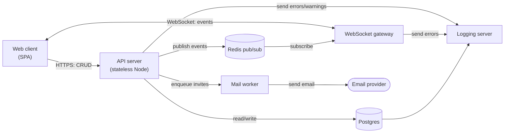
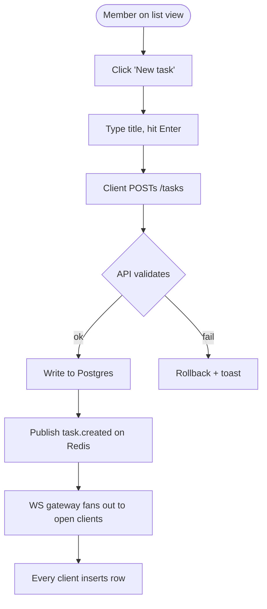
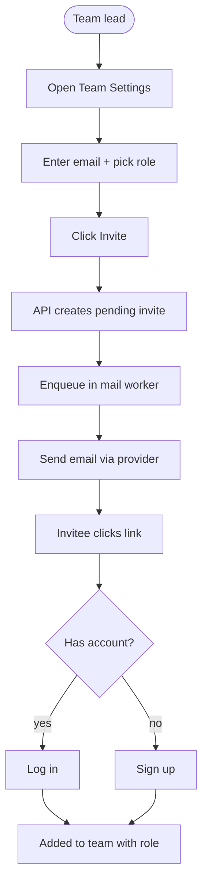
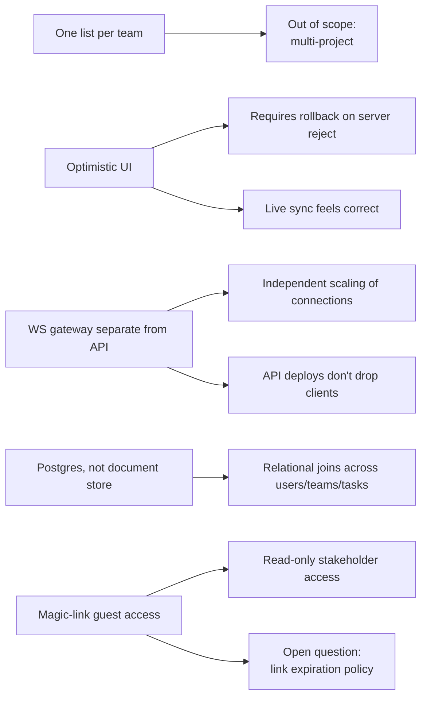
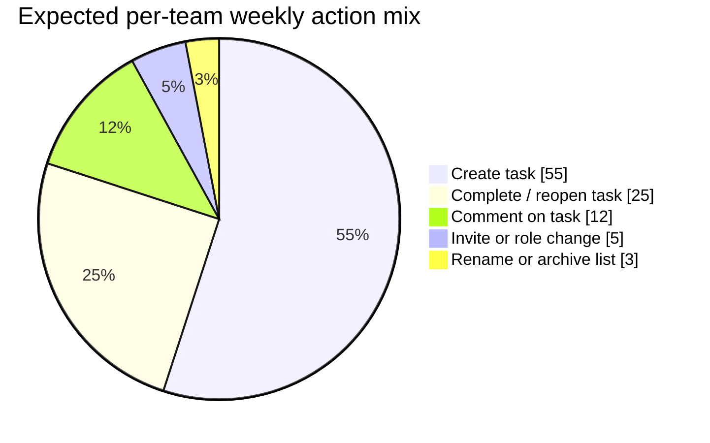

# Tasky — Product Spec

## Summary

**What we're building**

<!-- spec-tacle:summary:what -->
- Single-page web client in the browser talking to a stateless REST API
- Postgres stores users, teams, tasks, comments; Redis pub/sub carries real-time events
- A separate **WebSocket gateway** holds live connections and fans events out to every open browser for the team
- A mail worker sends invites and notifications through a third-party provider
- Four roles (member, team lead, magic-link guest, admin) and three surfaces (list, team settings, list item detail)
- a logging server to capture error logs and user logins
<!-- /spec-tacle:summary:what -->

**Why it earns the effort**

<!-- spec-tacle:summary:why -->
- Small teams currently juggle lists across Slack, sticky notes, and half-abandoned tools, so ownership and status drift
- Tasky picks a deliberately narrow shape (**one list per team**) so the state of the world is unambiguous
- Invests in optimistic UI and live sync so the shared list feels trustworthy enough to actually rely on
- Magic-link guests remove account friction for read-only stakeholders
<!-- /spec-tacle:summary:why -->

**Rules the system must uphold**

<!-- spec-tacle:summary:rules -->
- **Guests are read-only** — magic-link sessions cannot create, edit, comment on, or delete tasks under any circumstance
- Exactly **one list per team**; teams cannot fork, merge, or share lists across team boundaries
- A task's owner is always a member of the same team; reassigning to a non-member is rejected server-side
- Real-time events must reach every open browser for the team within 1 second of the API write; a slower fan-out is a bug, not degradation
- Audit-log entries for task creation, reassignment, and archive are append-only and never deleted, even when a team is archived
<!-- /spec-tacle:summary:rules -->

## Problem Statement

Small teams juggle to-do lists across Slack threads, sticky notes, and half-abandoned tools. Items lose their owner, deadlines slip silently, and nobody trusts the list to be current. Tasky is a single shared list per team — small enough to fit on one screen, structured enough that the state is unambiguous.

## Users

- **Member** — creates and completes their own tasks, sees the team's list, comments on items.
- **Team lead** — everything a member can do, plus reassigning tasks, archiving completed items, and inviting new members.
- **Guest** — read-only view of a single shared list via magic link. No account.
- **Admin** — **Assumption:** a super-user across the whole install. Everything a team lead can do on any team, plus creating and archiving teams, promoting a member to team lead, and viewing audit logs. Confirm in the visualizer or the Open Questions section.

## Solution Overview

A single web app with three primary surfaces:

1. A **list view** where tasks are grouped by status (todo, doing, done) and sortable by owner or due date.
2. A **list item detail** view where any team member can see a single task's full context—owner, status, due date, comments—and take actions (complete, reassign, comment) based on their role. Guests can view details but not edit.
3. A **team settings** page where team leads invite new members, assign roles, manage team composition, and control archive behavior.

Behind it: a small REST API, a Postgres database, and a Redis pub/sub channel that pushes changes to open browsers so two people editing the same list see each other's changes within a second.

## Core User Flows

### Flow: Create a task

1. Member clicks "New task" on the list view.
2. Inline row appears with focused title input.
3. Member types the title and hits Enter.
4. Client POSTs `/tasks` to the API.
5. API validates, writes to Postgres, publishes a `task.created` event on Redis.
6. All connected clients (including the creator) receive the event and insert the row.

### Flow: Complete a task

1. Member clicks the checkbox on a task row.
2. Client PATCHes `/tasks/:id` with `status: done`.
3. API updates the row, appends to the activity log, publishes `task.updated`.
4. Row animates into the "done" section on every client.

### Flow: Invite a teammate

1. Team lead opens Team Settings.
2. Enters an email address, picks a role, clicks Invite.
3. API creates a pending invite row and dispatches an email via the outbound mail worker.
4. Invitee clicks the link, signs up (or logs in), and is added to the team.

## Architecture

### Components

- **Web client** — single-page app in the browser. Talks to the API over HTTPS and subscribes to updates over a WebSocket.
- **API server** — stateless Node service. Handles auth, validation, CRUD, and publishes events to Redis.
- **WebSocket gateway** — separate service that holds long-lived connections, subscribes to Redis, and forwards events to the right clients.
- **Postgres** — primary data store. Tables: `users`, `teams`, `memberships`, `tasks`, `comments`, `activity_log`, `invites`.
- **Redis** — pub/sub channel for real-time events; also holds session tokens.
- **Mail worker** — background worker that reads a queue and sends invite / notification emails via a third-party provider.
- **Logging server** — **Assumption:** logs errors and warnings from API and other services for debugging and monitoring. Confirm scope and retention policy in Open Questions.

### Request flow (create task)

The web client sends the POST to the API server, which validates and writes to Postgres, then publishes to Redis. The WebSocket gateway is subscribed to Redis and fans the event out to every open connection for that team. Each client receives the event and updates its local state.

### Data model highlights

- A `task` belongs to exactly one `team` and has zero or one `owner` (a user id).
- A `comment` belongs to one `task` and one `author`.
- `activity_log` entries are append-only and reference the actor, the task, and the change type.
- `invites` carry a token, expiration, target email, and the role they'll grant on acceptance.

## Key Decisions

- **One list per team, not per project.** Keeps the mental model small. Multi-project support is explicitly out of scope for v1.
- **Optimistic UI updates.** The client applies changes locally before the server confirms; if the server rejects, the change rolls back with a toast. Chosen because real-time collaboration feels broken without it.
- **WebSocket gateway separate from API server.** Lets us scale long-lived connections independently and restart API deploys without dropping every connection.
- **Postgres over a document store.** The data is relational (users ↔ teams ↔ tasks ↔ comments). We'd fight a document store more than it'd help us.
- **Magic-link guest access.** No account for read-only viewers. Reduces friction for stakeholders who just want to see status.

## Out of Scope (v1)

- Multiple lists / projects per team.
- Mobile apps (the web app should be responsive, but no native).
- File attachments on tasks or comments.
- Third-party integrations (Slack, GitHub, calendar sync).
- Custom fields / tags beyond owner and due date.

## Open Questions

<!-- spec-tacle:summary:open-questions -->
- Do we need per-user notification preferences at launch, or is one global setting enough?
- Should archived tasks be purgeable, or retained forever for the activity log?
- What's the max team size we design for? Working assumption: 25.
- **Admin role capabilities** are guessed as a super-user across teams (team lifecycle, lead promotion, audit-log access). Confirm or correct.
- **Logging scope and retention.** What events should the logging server capture (errors only, warnings, debug traces)? How long should logs be retained?
<!-- /spec-tacle:summary:open-questions -->

## Diagrams

The visualizer at `generated/tasky-visualizer.html` renders these. Each diagram has a short caption for the picture-caption read and a longer "About this diagram" block for the reader who wants to slow down. Edit them there and use **Update spec** to write changes back here.

### System architecture and data flow

<!-- spec-tacle:diagram:architecture:caption -->
The full data plane. **HTTPS** for CRUD, a **WebSocket** for pushed events, and **Redis pub/sub** as the fan-out that keeps every open browser in sync within a second.
<!-- /spec-tacle:diagram:architecture:caption -->

<!-- spec-tacle:diagram:architecture:detail -->
- **Read/write path**: browser → API → Postgres
- **Real-time path**: API publishes to Redis, WS gateway subscribes and fans events out to every open client for that team
- **Async work**: API enqueues onto the mail worker, which hands off to a third-party email provider
- **Error logging**: API and WS gateway report errors and warnings to the logging server for observability
- **How to read**: primary data plane runs across the top, real-time loop-back runs through Redis and the WS gateway on the right, async email path branches down at the bottom, error path flows to the logging server
<!-- /spec-tacle:diagram:architecture:detail -->

<!-- spec-tacle:diagram:architecture:notes -->

<!-- /spec-tacle:diagram:architecture:notes -->

<!-- spec-tacle:diagram:architecture -->
**Nodes**

- `Browser`: Web client / (SPA).
- `API`: API server / (stateless Node).
- `WS`: WebSocket gateway.
- `PG`: Postgres.
- `Redis`: Redis pub/sub.
- `Mail`: Mail worker.
- `Provider`: Email provider.
- `Logger`: Logging server.

**Edges**

- `Browser` → `API`: "HTTPS: CRUD".
- `Browser` → `WS`: "WebSocket: events".
- `API` → `PG`: "read/write".
- `API` → `Redis`: "publish events".
- `Redis` → `WS`: "subscribe".
- `API` → `Mail`: "enqueue invites".
- `Mail` → `Provider`: "send email".
- `API` → `Logger`: "send errors/warnings".
- `WS` → `Logger`: "send errors".
- `PG` → `Logger`


<!-- /spec-tacle:diagram:architecture -->

### User flow — create a task

<!-- spec-tacle:diagram:create-task-flow:caption -->
The nine-step round-trip from a member typing a title to every open client seeing the row. **Validation failure** rolls back the optimistic insert with a toast.
<!-- /spec-tacle:diagram:create-task-flow:caption -->

<!-- spec-tacle:diagram:create-task-flow:detail -->
- **Golden path** (validation passes):
  - Client POSTs `/tasks` and inserts an optimistic row locally
  - API writes to Postgres, appends to the activity log, publishes `task.created` on Redis
  - WS gateway fans the event out to every open client for that team
  - Each client reconciles its optimistic row against the server's authoritative row
- **Fail path**: validation rejection removes the optimistic row and shows an error toast
- Nine steps in the linear path, so the diagram runs top-down
<!-- /spec-tacle:diagram:create-task-flow:detail -->

<!-- spec-tacle:diagram:create-task-flow:notes -->

<!-- /spec-tacle:diagram:create-task-flow:notes -->

<!-- spec-tacle:diagram:create-task-flow -->

<!-- /spec-tacle:diagram:create-task-flow -->

### User flow — invite a teammate

<!-- spec-tacle:diagram:invite-flow:caption -->
How a team lead brings a new member onto the team, from typing an email address to the invitee landing on the shared list with the right **role**.
<!-- /spec-tacle:diagram:invite-flow:caption -->

<!-- spec-tacle:diagram:invite-flow:detail -->
- Team lead opens User Management, enters an email, picks a role
- API creates a pending invite row and enqueues the outbound email
- Mail worker sends the invite via a third-party provider
- Invitee follows the link:
  - Already has an account: signs in and lands on the team with the pre-selected role
  - No account yet: completes signup, then lands on the team
- Eleven steps including the account-branch diamond, so the diagram runs top-down
<!-- /spec-tacle:diagram:invite-flow:detail -->

<!-- spec-tacle:diagram:invite-flow:notes -->

<!-- /spec-tacle:diagram:invite-flow:notes -->

<!-- spec-tacle:diagram:invite-flow -->

<!-- /spec-tacle:diagram:invite-flow -->

### Key decisions and what they shape

<!-- spec-tacle:diagram:decisions:caption -->
The five v1 decisions and the constraints they cascade into. Read left-to-right to trace **why** a constraint exists; read right-to-left to find **which decision** to revisit if a downstream constraint no longer holds.
<!-- /spec-tacle:diagram:decisions:caption -->

<!-- spec-tacle:diagram:decisions:detail -->
- Each decision on the left drives one or more downstream implications on the right
- Three implication shapes:
  - **Implementation choice** we're committed to
  - **Out-of-scope** item
  - **Open question** we know we owe an answer on
- The map is deliberately shallow so a reader can hold the whole thing in one glance
<!-- /spec-tacle:diagram:decisions:detail -->

<!-- spec-tacle:diagram:decisions:notes -->

<!-- /spec-tacle:diagram:decisions:notes -->

<!-- spec-tacle:diagram:decisions -->

<!-- /spec-tacle:diagram:decisions -->

### Expected per-team weekly activity mix

<!-- spec-tacle:diagram:activity-mix:caption -->
The shape of use the v1 decisions are priced against. **Task create + complete** dominate, which is what the optimistic UI and real-time push are being built for; invites and admin sit in the long tail.
<!-- /spec-tacle:diagram:activity-mix:caption -->

<!-- spec-tacle:diagram:activity-mix:detail -->
- These are **design-time guesses**, not measured usage — post-launch, replace them with numbers from the activity log.
- **Why it's here:** the spec's biggest calls (live sync, one list per team, magic-link guests) assume write traffic looks roughly like this. If it doesn't, those calls need a second look.
- Read it against the architecture diagram: the two big slices flow through the Redis fan-out, which is why that path is the hot one.
<!-- /spec-tacle:diagram:activity-mix:detail -->

<!-- spec-tacle:diagram:activity-mix:notes -->

<!-- /spec-tacle:diagram:activity-mix:notes -->

<!-- spec-tacle:diagram:activity-mix -->

<!-- /spec-tacle:diagram:activity-mix -->

### Roles × capabilities

<!-- spec-tacle:diagram:roles-matrix:caption -->
What each **role** can do on the shared list. Guests are read-only and can't reach team settings; only the team lead can invite or reassign.
<!-- /spec-tacle:diagram:roles-matrix:caption -->

<!-- spec-tacle:diagram:roles-matrix:detail -->
- Four columns, one per role; each row is a distinct capability the API enforces.
- **✓** = allowed, **—** = not allowed. A dash isn't the same as "probably not"; the API rejects it.
- Use this table to reconcile the roles list with the surface list: every surface should map to a subset of the rows here.
- If a new capability lands (attachments, mentions, etc.), add a row here first. The cell a guest gets is usually the load-bearing answer.
- **Assumption:** the Admin column reflects the guessed super-user shape from the Users section. Confirm it there before treating this table as authoritative.
<!-- /spec-tacle:diagram:roles-matrix:detail -->

<!-- spec-tacle:diagram:roles-matrix:notes -->

<!-- /spec-tacle:diagram:roles-matrix:notes -->

<!-- spec-tacle:diagram:roles-matrix -->
```mermaid
<!-- ASSUMPTION: Admin column is a best guess (super-user across teams). Confirm in the visualizer. -->
| Capability                  | Member | Team lead | Guest | Admin |
|-----------------------------|--------|-----------|-------|-------|
| See the team list           | ✓      | ✓         | ✓     | ✓     |
| Open a task's detail        | ✓      | ✓         | ✓     | ✓     |
| Create a task               | ✓      | ✓         | —     | ✓     |
| Complete or reopen a task   | ✓      | ✓         | —     | ✓     |
| Comment on a task           | ✓      | ✓         | —     | ✓     |
| Reassign a task's owner     | —      | ✓         | —     | ✓     |
| Archive completed items     | —      | ✓         | —     | ✓     |
| Invite a new teammate       | —      | ✓         | —     | ✓     |
| Change a member's role      | —      | ✓         | —     | ✓     |
| Create or archive a team    | —      | —         | —     | ✓     |
| Promote a member to lead    | —      | —         | —     | ✓     |
| View audit logs             | —      | —         | —     | ✓     |
```
<!-- /spec-tacle:diagram:roles-matrix -->
